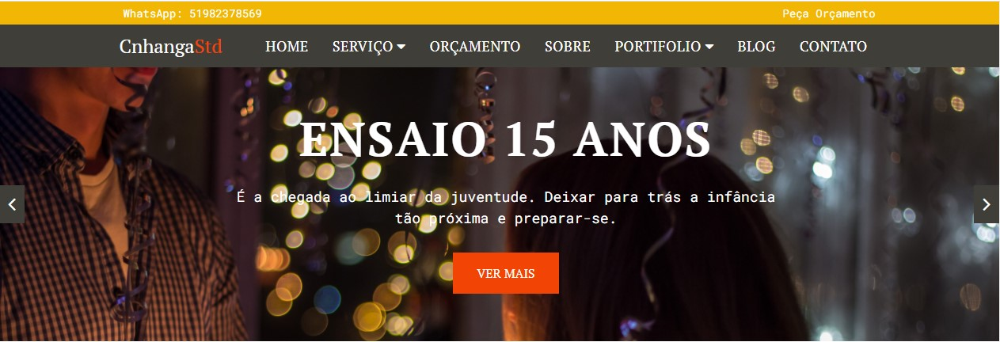

# CnhangaStd

## Este é um site simulando uma agencia de fotografia 

 

### Estato do Projeto: Em desenvolvimento
 
 

### Tecnlogias Utilizadas 
- [x] Js
- [x] php
- [x] html
- [x] css

### API Consumidas
- [x] ViaCep "https://viacep.com.br/"
- [x] Unsplash Image API "https://unsplash.com/developers"

 

### Projeto

### pre requistos para rodar a aplicação

vai precisar de ter instalado na sua maquina um servidor, como por exemplo o XAMPP
 
 

### Clone este repositorio
https://github.com/claudionhangapc/CnhangaStd.git
### Autor

##### Nome: Claudio Nhanga
##### Email: claudionhangapc1@gmail.com
